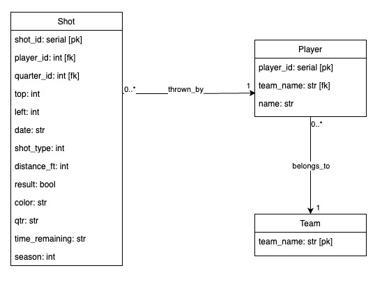

# NBA Shots Season 22-23 

## Introduction
This project shows the data model of the NBA shots dataset for the 2022/2023 season. 
The dataset provides insights into LeBron James, James Harden and Stephen Curry shots and related information for the season.

## Source Dataset
The dataset used in this project can be found [here](https://www.kaggle.com/datasets/dhavalrupapara/nba-2023-player-shot-dataset/).

## Project Structure
The project structure includes the following components:

- **data Folder**: Contains the csv files, which are not committed to the repository.
- **helpers Folder**: Includes code for creating a PostgreSQL database and its associated methods. It also includes a 
`utils` Python File that contains utility methods, including those for reading CSV files and returning Pandas DataFrames.
- **images Folder**: Contains a database diagram in PNG format showing tables and attributes.
- **main.py**: The primary file in the root directory that orchestrates data processing. It reads CSV files, creates the database if it doesn't exist, generates tables, and populates them with the data.

## Database Diagram


## Installation and Execution
### Dependency Management
The project's library dependencies are managed using Poetry. If you don't have Poetry installed, you can get it from [here](https://python-poetry.org/docs/#installation).

After installing Poetry, navigate to the project directory and execute the following command to install dependencies:
```bash
poetry install
```

### Running the project
To run the project, execute the following command:
```bash
poetry run python main.py
```

## Creator
This project was created by **Ana Escobar Llamazares**. 
For any inquiries or clarifications, please reach out to via [email](mailto:anaescobar@ana-escobar.com).

Feel free to explore and contribute to this project!
